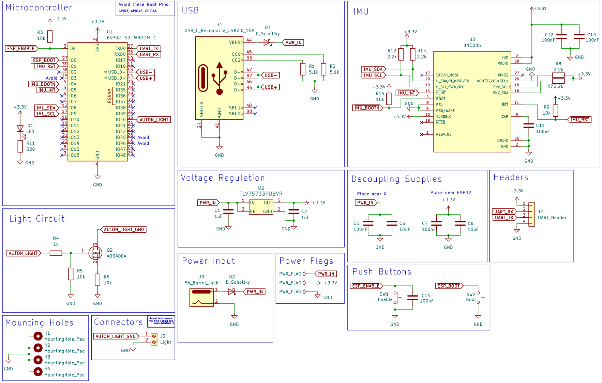
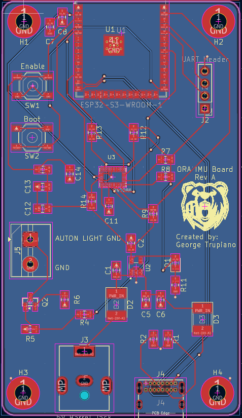

# ORA IMU Board

**Custom PCB that implements the following features:**
   - ESP32 on board for running MicroROS framework
   - Use of external 9-DOF IMU
   - MOSFET circuit for controlling 24V stack light
   - Powering over USB-C and Barrel Jack
   - UART Debugging

## Schematic

### Design Notes
While creating the schematic, a markdown file was created to note how design decisions came about. This is all present in the [PCB Design Notes](./Documentation/PCB_Design_Notes.md).
  

## Layout

  

## 3D View
