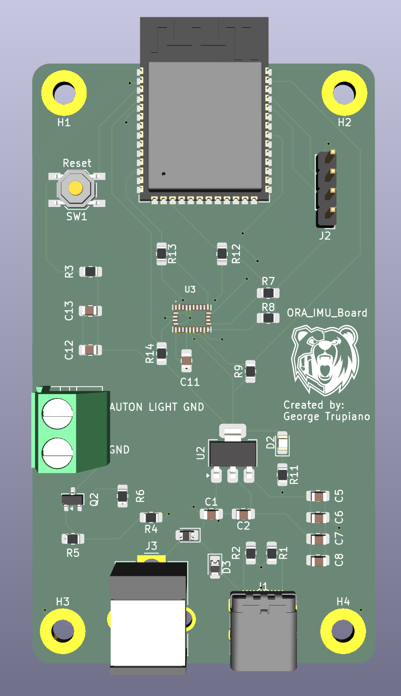

# ORA IMU MicroROS System
In the robots developement for the International Ground Vehicle Competition (IGVC), a system was developed for interfacing with lower level peripherals and communicating with devices upstream.

## System Components Implemented
1. Custom PCB that implements the following features:
   - ESP32 on board for running MicroROS framework
   - Use of external 9-DOF IMU
   - BJT circuit for controlling 24V stack light
   - Powering over USB-C and Barrel Jack
   - UART Debugging
   
2. Software running on ESP32 to implement the following features:
   - Data capturing of external IMU
   - Publish IMU data to ROS topic
   - Service messages controlling robot stack light
  

## 3D View
