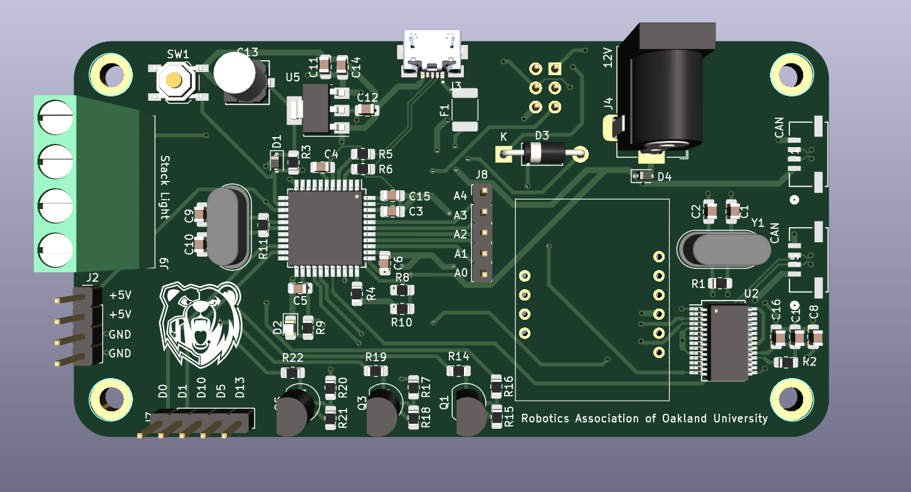
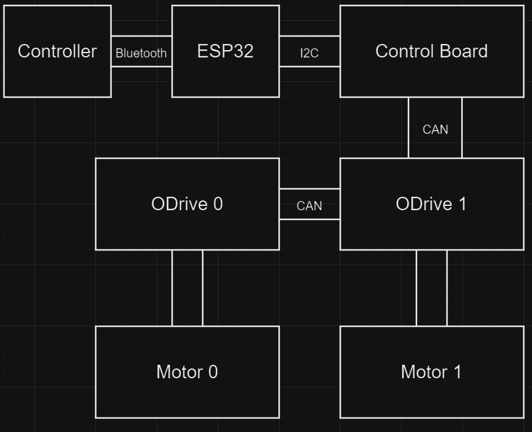

# Oakland Robotics Association (ORA)

## IGVC Competition Overview

Each year, the Robotics Association at Oakland University takes part in the International Ground Vehicle Competition (IGVC), focusing on the auto-nav challenge. In this competition, teams are tasked with designing a fully autonomous unmanned ground robotic vehicle capable of navigating an outdoor obstacle course within a set timeframe, while adhering to specified speed constraints. The 2024 IGVC is scheduled to be held at Oakland University from May 31 to June 3, 2024. Our team will develop an entirely new robot for this year's challenge.

### Electrical Subteam Goals

For the 2024 competition, our goal is to design, implement, and document the electrical subsystem of our intelligent robotic platform. This will involve collaboration with the mechanical and software subteams to ensure that the electrical components integrate seamlessly. The subsystem will feature a variety of components, including:
- Sensors (e.g., IMUs, GPS, cameras)
- Motors
- Low-level controllers (e.g., Arduino)
- Power distribution system (batteries, BMS, power converters, etc.)
- LED display
- Safety features (emergency stops, fuses, light indicators)

Detailed documentation and a comprehensive final report will be prepared to integrate into the IGVC final report.

## Design Components and Layout

### Control Board Overview

The Control Board is designed to streamline the connections between various components, reducing the complexity of wiring and enhancing overall efficiency. Key features include integration of ODrives over CAN for motor control and management of the status light system. The board centralizes connections, making it easier to manage and troubleshoot the system.

### Robot Control Layout

This layout illustrates the schematic organization of the robot's driving and control systems. It highlights how different components interconnect and function together to provide optimal control and performance during competition.
